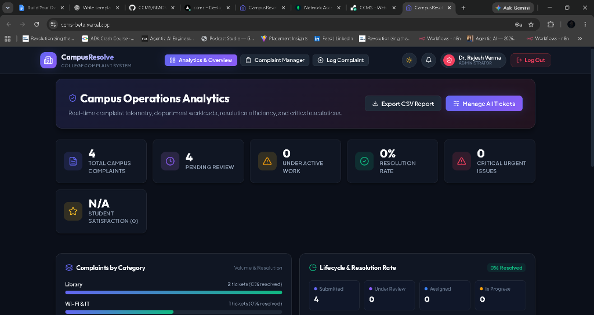

# 🏛️ 1. Project Name

**CampusResolve — College Complaint Management System (CCMS)**

[](https://reactjs.org/)
[](https://vitejs.dev/)
[](https://nodejs.org/)
[](https://expressjs.com/)
[](https://www.mongodb.com/cloud/atlas)
[](LICENSE)

---

## 📋 2. Problem Statement

In traditional collegiate environments, grievance redressal and campus maintenance workflows are often fragmented across paper-based complaint registers, informal messaging channels, and delayed phone calls. This leads to critical drawbacks:
- **Lack of Transparency**: Students cannot track the real-time status or technician assignment of their complaints.
- **Delayed Department Resolution**: Maintenance, IT, and Hostel staff lack centralized task queues with priority escalation.
- **Zero Accountability & Audit Trail**: Administrators have no visibility into recurring campus bottlenecks, department response times, or student satisfaction.

**CampusResolve (CCMS)** solves these challenges by providing a secure, centralized, role-based web platform connecting **Students**, **Department Staff**, and **Campus Administrators** in real time, featuring automated priority triage, evidence attachments, instant resolution emails, and transparent rating feedback.

---

## ✨ 3. Features

### 🎓 Student Portal (Core & Smart Features)
- **Interactive Dashboard**: Real-time summary of personal tickets, resolution metrics, and activity history.
- **Smart Grievance Wizard**:
  - Category selector (Hostel, Academics, Wi-Fi & IT, Canteen, Electrical & Plumbing, Security, etc.).
  - Precise location targeting (Building, Floor, Room Number).
  - Photo evidence attachment with live client-side preview.
  - **AI Urgency Advisor**: Scans complaint text for urgent hazard keywords (*fire*, *spark*, *water leak*, *short circuit*) and automatically recommends critical priority elevation.
- **6-Stage Live Lifecycle Bar**: Visual timeline tracker (`Submitted` ➔ `Under Review` ➔ `Assigned` ➔ `In Progress` ➔ `Resolved` ➔ `Closed`).
- **Real-Time Interactive Discussion**: Two-way messaging thread between student and assigned technician.
- **Automated Resolution Notice**: Dispatches a branded HTML email to the student with staff remarks and feedback action link upon resolution.
- **5-Star Resolution Feedback**: Students review repair quality and submit 1–5 star ratings to confirm ticket closure.

### 🛡️ Administrator & Dean Portal
- **Executive KPI Dashboard**: Live stats for total complaints, pending triage, active repairs, resolution rate, and average campus satisfaction score.
- **Interactive Visual Analytics**: Category volume distribution, department workload breakdown, and status progression charts.
- **Complaint Management Engine**: Advanced search and multi-parameter filtering (by student, room, title, category, priority, status).
- **Technician Dispatch & Triage**: One-click staff assignment and department reassignment.
- **Priority Escalation**: Adjust urgency between `Low`, `Medium`, `High`, and `Critical`.
- **Security Audit Trails**: Real-time logging of logins, status updates, ticket deletions, and assignment events.

### 🔧 Department Staff Portal
- **Role-Scoped Work Queue**: Filtered work orders tailored to specific departments (Wi-Fi/IT, Hostel, Maintenance, Electrical, Mess).
- **Quick Status Transitions**: Accept tickets, mark `In Progress`, and record completion proof with technical remarks (`Resolved`).

---

## 🛠️ 4. Technology Stack

| Layer | Technology / Library | Purpose |
|---|---|---|
| **Frontend UI** | **React 18** + **Vite 5** | High-performance Single Page Application (SPA) with responsive glassmorphism UI |
| **Icons & Visuals** | **Lucide React** | Modern, accessible SVG icon system |
| **Backend API** | **Node.js** + **Express.js** | Modular RESTful API server |
| **Database** | **MongoDB Atlas** + **Mongoose** | Managed cloud database with strongly typed schemas and relations |
| **Authentication** | **JWT (JSON Web Tokens)** + **bcryptjs** | Stateless token auth with salted password hashing (10 rounds) |
| **Security & Headers** | **Helmet** + **express-rate-limit** | Protection against XSS, clickjacking, MIME-sniffing, and brute-force attacks |
| **Validation & Sanitization**| **validator.js** | Strict backend input validation and HTML entity escaping |
| **File Storage** | **Multer** | Secure multi-part image uploads (JPEG/PNG/WEBP up to 5MB) |
| **Automated Emails** | **Nodemailer** | Responsive HTML email template dispatching upon resolution |
| **Deployment** | **Vercel** (Frontend) + **Render** (Backend) | Cloud hosting with automated continuous deployment |

---

## 📸 5. Screenshots

### 📊 Campus Operations Analytics & Dean Administrator Dashboard


#### Key Application Interfaces & Workflows:
1. **Dean & Admin Operations Suite**: Real-time KPI telemetry, complaints by category, lifecycle resolution rate, CSV export, and faculty assignment.
2. **Student Complaint Submission Wizard**: Category selector, precise campus location, photo attachments, and AI urgency detection.
3. **Interactive Ticket Details & Timeline**: Chronological 6-stage lifecycle stepper and live discussion thread between student and squad lead.
4. **Department Squad Task Queue**: Filtered work orders for IT, Hostel, Maintenance, and Electrical officers.
5. **Resolution 5-Star Feedback Modal**: Student satisfaction ratings and comments upon grievance resolution.

---

## 🌐 6. Live Demo

- **Frontend Live URL**: **[https://ccms-beta.vercel.app](https://ccms-beta.vercel.app)** *(Hosted on Vercel)*

---

## 🚀 7. Backend

- **Backend REST API Live URL**: **[https://ccms-n753.onrender.com](https://ccms-n753.onrender.com)** *(Hosted on Render)*
- **API Healthcheck Endpoint**: **[https://ccms-n753.onrender.com/api/health](https://ccms-n753.onrender.com/api/health)**

---

## 💻 8. Setup Instructions

Follow these steps to run the complete project locally:

### Prerequisites
- **Node.js** (v18.x or higher)
- **npm** (v9.x or higher)
- **Git**

### Step 1: Clone the Repository
```bash
git clone https://github.com/poleboina-gopi/CCMS.git
cd CCMS
```

### Step 2: Install All Dependencies
Install dependencies across root, backend, and frontend with a single command:
```bash
npm run install:all
```

### Step 3: Configure Environment Variables
Create `.env` files from the provided templates:
```bash
# In backend/ directory:
cp backend/.env.example backend/.env

# In frontend/ directory:
cp frontend/.env.example frontend/.env
```
*(See Section 9 below for required environment variable names)*

### Step 4: Run Development Server
```bash
npm run dev
```
- **Frontend Application**: `http://localhost:5173`
- **Backend API**: `http://localhost:5000`

---

## 🔐 9. Environment Variables

> [!IMPORTANT]
> In compliance with security best practices, actual API keys, database passwords, and private secrets are **never committed to GitHub**. Use environment variables as shown below:

### Backend Variables (`backend/.env`)

| Variable Name | Description | Example / Default |
|---|---|---|
| `PORT` | Local API server listening port | `5000` |
| `NODE_ENV` | Environment mode (`development` or `production`) | `production` |
| `JWT_SECRET` | Secret key for signing JSON Web Tokens | `your_super_secret_jwt_key_here` |
| `MONGODB_URI` | MongoDB Atlas cloud connection URI | `mongodb+srv://<user>:<pass>@cluster0.mongodb.net/ccms` |
| `CLIENT_URL` | Allowed frontend origin for CORS whitelist | `https://ccms-beta.vercel.app` |
| `SMTP_HOST` | *(Optional)* SMTP mail server host | `smtp.gmail.com` |
| `SMTP_PORT` | *(Optional)* SMTP port | `587` |
| `SMTP_USER` | *(Optional)* SMTP email address | `your_email@gmail.com` |
| `SMTP_PASS` | *(Optional)* SMTP app password | `your_smtp_app_password` |

### Frontend Variables (`frontend/.env`)

| Variable Name | Description | Example / Default |
|---|---|---|
| `VITE_API_URL` | Base URL of the backend API (Leave blank in local dev) | `https://ccms-n753.onrender.com` |

---

## 📜 License
This project is open-source under the **MIT License**.
